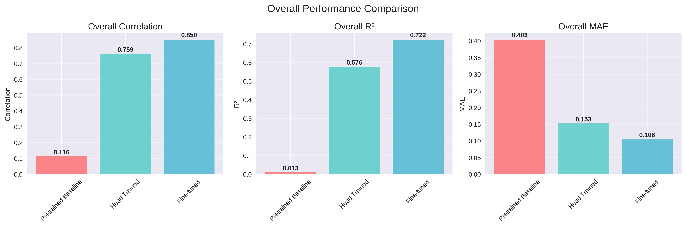

# Galaxy Sommelier: A Study on Out-of-Distribution Generalization by Mixing Astronomical Survey Data

An investigation into how training on mixed-survey astronomical data affects the out-of-distribution (OOD) generalization of Vision Transformer models for galaxy morphology classification.

## Project Overview

This project explores the effectiveness of improving model generalization by training on a diverse dataset from multiple astronomical surveys. We use a Vision Transformer (DINOv2) to classify galaxy morphologies and specifically investigate how a model trained on a mix of SDSS and DECaLS survey data performs when evaluated on a completely unseen survey, UKIDSS. This serves as a key test for out-of-distribution robustness, a critical requirement for building universal astronomical models.

## Results

Our initial training on a single survey (SDSS) demonstrates strong performance, with significant improvements across all morphological classification tasks:

### Performance Summary (SDSS-only model)
- **Overall Correlation**: 0.85 (R² = 0.72)
- **Mean Absolute Error**: 0.106 
- **Main Morphology Classification Accuracy**: 62.5%

### Training Stage Progression
| Stage | Overall Correlation | Overall R² | MAE | Notes |
|-------|-------------------|------------|-----|--------|
| Pretrained Baseline | 0.116 | 0.013 | 0.403 | Poor performance across all features |
| Head Training | 0.759 | 0.576 | 0.153 | Major improvement, learned basic concepts |
| Full Fine-tuning | **0.850** | **0.722** | **0.106** | Best performance, refined all features |


**Overall Performance Comparison**


**Distribution Comparison: True vs Predicted**


### Key Morphological Features Performance
- **Disk Fraction** (smooth vs featured): r = 0.968 (excellent)
- **Edge-on Detection**: r = 0.935 (excellent) 
- **Odd Features Detection**: r = 0.932 (excellent)
- **Spiral Detection**: r = 0.857 (very good)
- **Bar Detection**: r = 0.772 (good)
- **Bulge Dominance**: r = 0.506 (moderate - most challenging feature)

The model successfully learned to classify most galaxy morphological characteristics, with geometric and structural features showing the strongest performance. Bulge prominence assessment remains the most challenging task, likely requiring additional specialized techniques.

## Out-of-Distribution Evaluation

We tested the model's generalization capabilities by evaluating on **UKIDSS** data (completely unseen survey) compared to the training distribution (**SDSS**). This tests the model's ability to work across different astronomical surveys with varying image properties.

### Cross-Survey Performance Results

| **Metric** | **SDSS (In-Distribution)** | **UKIDSS (Out-of-Distribution)** | **Degradation** |
|------------|----------------------------|-----------------------------------|-----------------|
| **Overall Correlation** | 0.893 | 0.839 | **-6.0%** |
| **R²** | 0.797 | 0.704 | **-11.6%** |
| **Mean Absolute Error** | 0.085 | 0.141 | +65.6% |

### Key Morphological Features Performance

| **Feature** | **SDSS (r)** | **UKIDSS (r)** | **Degradation** |
|-------------|--------------|----------------|-----------------|
| **Disk Detection** | 0.986 | 0.829 | -16.0% |
| **Edge-on Detection** | 0.856 | 0.754 | -11.9% |
| **Odd Features** | 0.928 | 0.773 | -16.7% |
| **Spiral Arms** | 0.963 | 0.655 | -32.0% |
| **Bar Features** | 0.913 | 0.521 | -43.0% |


### Performance Visualization

**Out-of-Distribution Performance**


The plots above demonstrate the improvement from pretrained baseline through head training to full fine-tuning for the SDSS-only model.

## SDSS-only vs. Mixed-Survey Model Comparison

To test the hypothesis that training on more diverse data improves generalization, we compared two models:
1.  **SDSS-only Model**: Fine-tuned on the full SDSS dataset of ~239,000 galaxies, predicting 74 morphological features.
2.  **Mixed-Survey Model**: Fine-tuned on a balanced, combined dataset of ~186,000 galaxies. This set was constructed by taking all ~93,000 DECaLS galaxies and combining them with a random sample of ~93,000 SDSS galaxies. This model predicts 52 features common to both surveys.

Both models were evaluated on the completely unseen UKIDSS dataset. The comparison was performed on the 9 morphological features available in the UKIDSS ground truth data.

### Results on UKIDSS Data

The model trained on the mixed-survey dataset demonstrated superior performance across all metrics, confirming that exposure to more varied data improves the model's ability to generalize to new, unseen surveys.

| Metric | SDSS-only Model | Mixed (SDSS+DECaLS) Model |
| :--- | :--- | :--- |
| **Correlation** | 0.819 | 0.857 |
| **R-squared** | 0.671 | 0.735 |
| **MAE** | 0.153 | 0.126 |
| **MSE** | 0.051 | 0.039 |

### Performance Visualization

To see exactly where the mixed-survey model improves, we can compare the per-task correlation on the 9 features available in the UKIDSS dataset.


The mixed-survey model shows improved correlation across all available features, with the most significant gains in identifying bar and spiral features. This confirms that training on more diverse data leads to a more robust and generalizable model.

## Maximum Overlap Experiment

We also tested a "maximum overlap" approach, training on galaxies that appear in both SDSS and DECaLS surveys to maximize cross-survey consistency. However, this approach achieved lower performance (0.796 correlation) compared to the mixed random sampling approach (0.810 correlation), suggesting that dataset diversity is more beneficial for generalization than cross-survey overlap.

## High Quality Data Experiment

We further tested whether using higher quality SDSS data (galaxies with higher classification counts) would improve out-of-distribution performance. The high-quality mixed model achieved 0.855 correlation compared to 0.857 for the original mixed model, showing minimal difference and suggesting that data quality filtering provides limited benefits beyond the base dataset quality.

<!-- ## Phase 1: Foundation Setup ✅

**Status**: Implementation Complete

### Completed Components

- [x] Project structure setup
- [x] Data directories on NERSC scratch space
- [x] Galaxy Zoo data downloader (`scripts/download_galaxy_zoo_data.py`)
- [x] DINOv2-based model architecture (`scripts/model_setup.py`)
- [x] Data processing pipeline (`scripts/data_processing.py`)
- [x] Training infrastructure (`scripts/train_baseline.py`)
- [x] Configuration management (`configs/base_config.yaml`)
- [x] Requirements specification (`requirements.txt`) -->

### Key Features

- **DINOv2 Backbone**: Pre-trained Vision Transformer for robust feature extraction
- **Galaxy Zoo Integration**: Automated download and processing of Galaxy Zoo catalogs
- **SDSS Image Pipeline**: FITS image loading and preprocessing
- **Mixed Precision Training**: Efficient training with automatic mixed precision
- **Comprehensive Logging**: Integration with Weights & Biases for experiment tracking
- **Flexible Configuration**: YAML-based configuration system
<!-- 
## Quick Start

### 1. Environment Setup

```bash
# Create conda environment
conda create -n galaxy-sommelier python=3.10
conda activate galaxy-sommelier

# Install dependencies
pip install -r requirements.txt
```

### 2. Download Data

```bash
# Download Galaxy Zoo catalogs
python scripts/download_galaxy_zoo_data.py --download-catalogs --sample-size 1000

# Download SDSS images
python scripts/download_galaxy_zoo_data.py --download-images --sample-size 100
```

### 3. Train Baseline Model

```bash
# Train with sample data
python scripts/train_baseline.py --sample-size 100 --epochs 5

# Full training with W&B logging
python scripts/train_baseline.py --wandb
``` -->

## Project Structure

```
galaxy-sommelier/
├── configs/                 # Configuration files
│   └── base_config.yaml    # Base training configuration
├── data/                   # Symbolic link to scratch storage
├── models/                 # Model checkpoints
├── results/                # Training results and logs
├── scripts/                # Core implementation
│   ├── download_galaxy_zoo_data.py  # Data acquisition
│   ├── model_setup.py               # Model architecture
│   ├── data_processing.py           # Data pipeline
│   └── train_baseline.py            # Training script
├── notebooks/              # Analysis notebooks
├── tests/                  # Unit tests
├── docs/                   # Documentation
├── requirements.txt        # Python dependencies
└── README.md              # This file
```

<!-- ## Configuration

The project uses YAML configuration files for easy parameter management. Key settings:

- **Model**: DINOv2 variant, output dimensions, dropout rate
- **Training**: Learning rate, batch size, number of epochs
- **Data**: Paths to catalogs and images, preprocessing options
- **Logging**: Checkpoint frequency, W&B settings

## Data Storage

- **Scratch Directory**: `/pscratch/sd/s/sihany/galaxy-sommelier-data/`
- **SDSS Images**: `data/sdss/`
- **Catalogs**: `data/catalogs/`
- **Processed Data**: `data/processed/` -->

<!-- ## Hardware Requirements

- **GPU**: NVIDIA A100 (available on NERSC Perlmutter)
- **Memory**: 16GB+ RAM recommended
- **Storage**: 100GB+ for full Galaxy Zoo dataset

## Next Steps (Phase 2)

- [ ] DESI Legacy Imaging data collection
- [ ] Cross-survey matching and validation
- [ ] Distribution shift analysis
- [ ] OOD testing framework -->

<!-- ## Contributing

This project follows the plan outlined in `plan.txt`. Please refer to the plan for detailed implementation roadmap and contribute according to the phase structure. -->

## License

Research use only. Please cite appropriately if using this code for academic purposes.
<!-- 
## Contact

Project developed as part of galaxy morphology research at NERSC. -->
